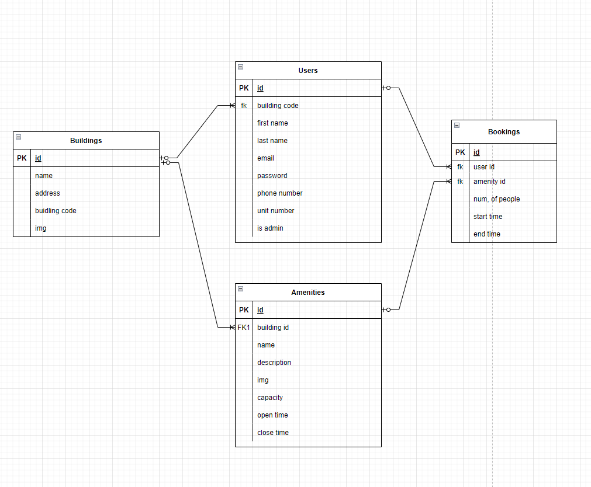
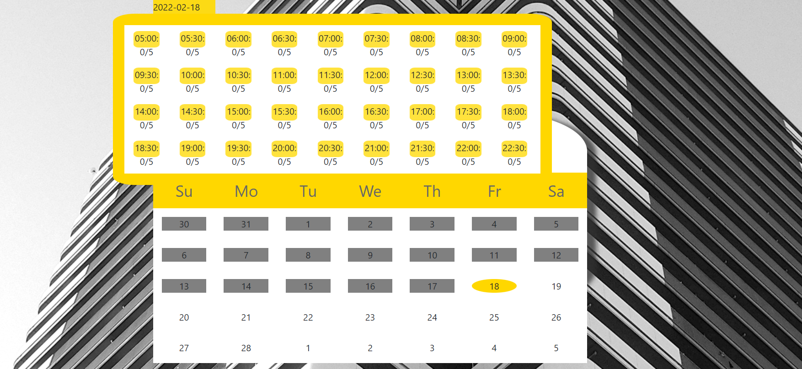

# CondoFlex App

## Project Description

Attentive property managers should know how to arrange for building amenities, as well as booking system as part of their comprehensive condominium management services.

## Project Stack
- HTML, CSS, React JS on the front end
- Node, Express, Postgresql, Prsima on the server-side

## Our App Allows

### User to:
- login as a user 
- register if not a user
- see the amenities online
- booking the amenities online
- review their booking details
- modify their booking 

### Admin to:
- create/edit/delete new user
- create/edit/delete new amenities
- create/edit/delete booking scheduling

## ERD for this Project

## User Stories

## Final Product

### Main Page

### Amenities Booking Review

## Dependencies

### Front side dependencies
- axios
- classnames
- moment
- node-sass
- react
- react-cookie
- react-dom
- react-router-dom 
- react-scripts

### Sever side - production dependencies
- @prisma/client
- @prisma/engines
- body-parser
- cookie-session
- cors
- dotenv
- express

### Sever side - development dependencies
- @types/node
- prisma
- ts-node,
- typescript
- nodemon

## Getting Started
- Create the .env by using .env.example as a reference: cp .env.example .env
- Update the .env file with your correct local information (username: devlopment; password: devlopment; database: condflex)
- Install dependencies: npm i
- Install the Prisma CLI : npm install @prisma/cli --save-dev
- Create Prisma setup: npx prisma init
- Install prisma: npm install prisma --save-dev
- Reset database: npx prisma db reset (check the prisma folder to see what schema.prisma and seed.js created)
- Run the server or back end: npm start (note: nodemon is used, so you should not have to restart your server)
- Run the client or front end: npm start (note: nodemon is not used, so you should have to restart your server)
- Visit http://localhost:8080/ for server
- Visit http://localhost:3000/ for client

## Developers Team

[JP Kalambay](https://github.com/kalambayjp), [Ruona Clinton](https://github.com/clintonomamohwo) and [Sanjoy Kumar Das](https://github.com/sanjoy-kumar/)

